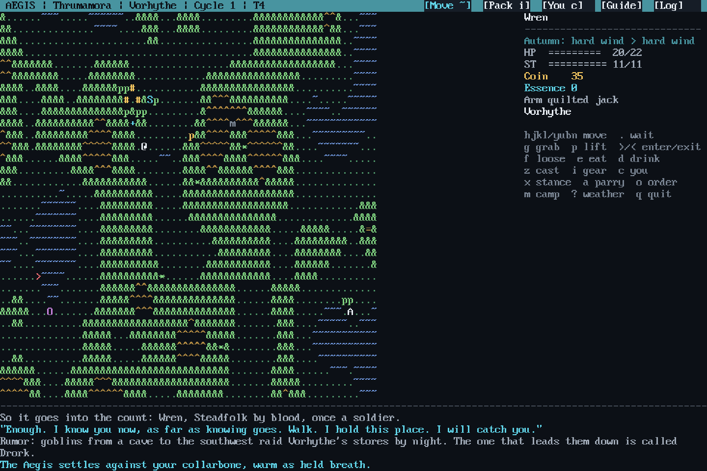
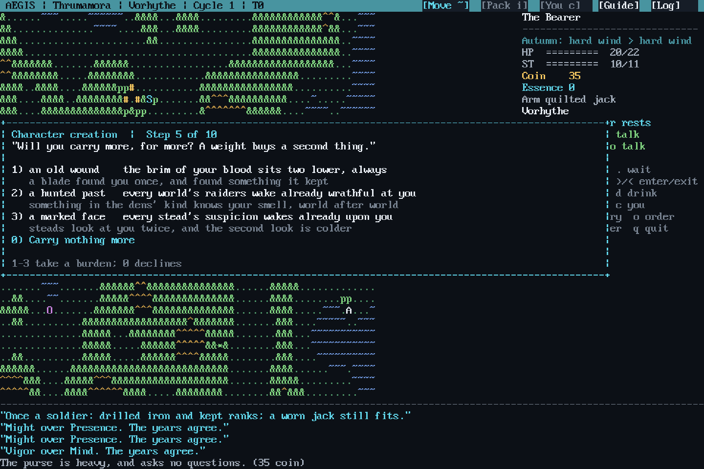
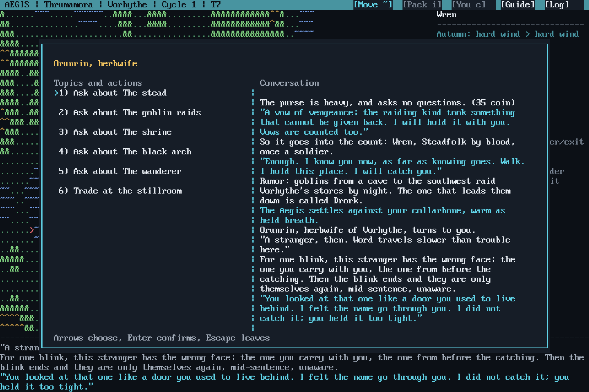
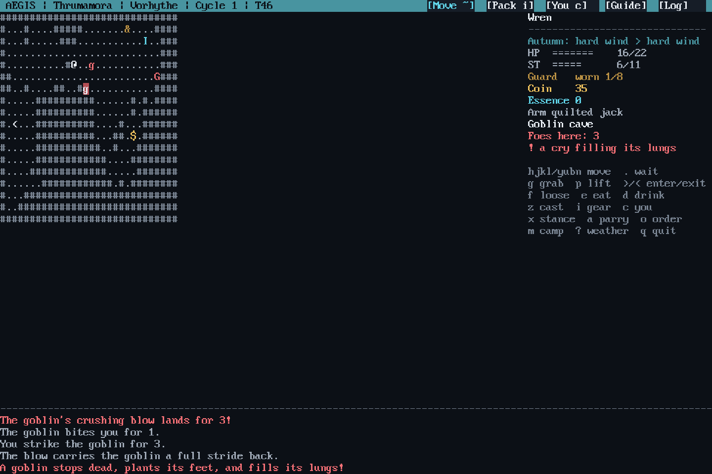
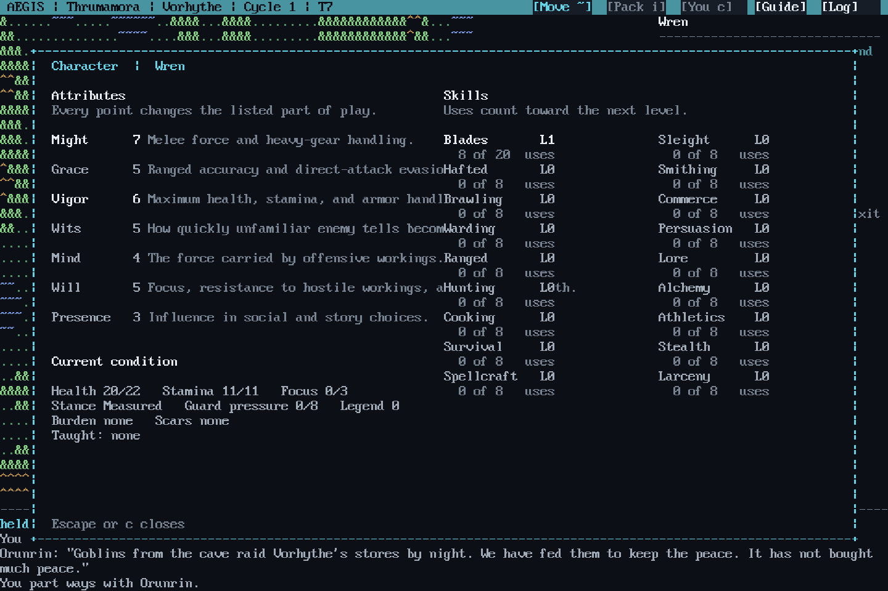
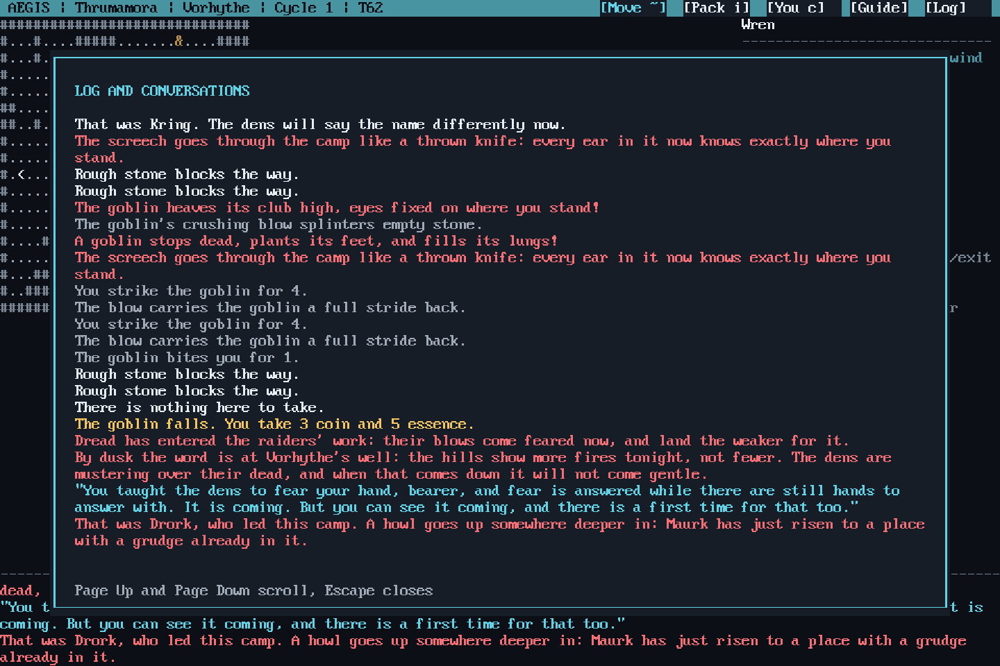

# Aegis

Aegis is a single-player turn-based tiled role-playing game for Windows.
Every campaign is generated from a seed and saved as an append-only action journal.
It makes no network calls and has no telemetry.



*The shipped `v1.0.0-rc1` client. Every frame here is a real session, seed 42, captured through the pilot channel described in [`docs/dev-harness.md`](docs/dev-harness.md).*

<details>
<summary><b>More screenshots</b> (character creation, conversation, combat, the character sheet, the log)</summary>

<br>

**Character creation is ten questions, not a stat allocator.** Each answer is a sentence about who you were, and the mechanical effect is stated in the same breath. Attribute rises are paid for out of another attribute, so a build is a set of trades rather than a pile of points.



**Conversation keeps a transcript.** Topics on the left, everything said so far on the right, and villagers answer about the things this particular world is doing rather than from a fixed script.



**Combat is turn-based and telegraphed.** Enemies wind up a heavier attack a turn before it lands, and the sidebar names the tell while it is readable, which is what the Wits attribute buys. Guard pressure, stamina and stance all sit in the same panel as your health.



**Seven attributes and eighteen skills**, with skills levelling from use rather than from spent points. Every attribute line states exactly what part of play it changes.



**The log is the game's memory, and it is written rather than reported.** Killing the camp's leader does not print a victory line; it prints what the dens now know, and who has just risen to replace him.



</details>

## Status

The packaged Windows build on the Releases page is tagged `v1.0.0-rc1`: a complete,
feature-finished release candidate that has not yet cleared its final manual playthrough
gate. The ten-card guided playtest that gate depends on lives in
`artifacts/release-review-1.0.0/`. It will be retagged `v1.0.0` when that passes.

Development since the candidate was packaged (decisions D-181 through D-200) has moved
the player client from SadConsole to Godot under the contract in
`design/godot-client-modernization.md`. The candidate build ships the SadConsole client.

## Run

Extract the release zip to a writable folder and run `aegis.exe`.

The 1.0 package supports Windows x64. Aegis opens its own window and owns its font,
palette, and 120 by 40 layout. Drag the window edge or maximize it as needed. The full
frame remains visible with letterboxing when the window shape differs from the grid.

On first launch, a presentation-only help card explains the window controls. Font scale
1 or 2 can be selected with `aegis.exe --font-scale 1` or
`aegis.exe --font-scale 2`. The choice is stored separately from campaign saves in
`%LOCALAPPDATA%\Aegis\presentation.json`.

## Controls

- Move with `h j k l`, diagonals with `y u b n`, or use the arrow keys.
- Wait with `.`.
- Enter or leave with `>` and `<`.
- Interact or gather with `g`.
- Open help in the game with `?`.
- Quit with `q`.

The game presents contextual controls in its sidebar and explains additional combat,
travel, equipment, and conversation commands as they become relevant.

## Saves

Start a named campaign with:

```text
aegis.exe --save my-campaign
```

Named saves live under `%LOCALAPPDATA%\Aegis\saves` by default. Every accepted key is
flushed to the journal immediately. Running without `--save` creates a temporary unsaved
session. Use `aegis-tools.exe saves` to list slots.

Save version 100 pins world generator version 1. Older save versions are intentionally
rejected because Aegis does not silently migrate or reinterpret an old campaign.

## Verification tools

The separate tools executable carries deterministic local verification commands:

```text
aegis-tools.exe sim --seed 1 --keys "0...." --quiet
aegis-tools.exe journey --seed 1 --cycles 1 --json
aegis-tools.exe worldgen --seeds 2 --tiers 1-2 --json
```

These tools do not read or alter named saves unless a save path is explicitly supplied
to the normal game command.

## Support boundaries

Version 1.0 has no installer, updater, cloud save, networking, code signing, Linux
package, or macOS package. Keep the extracted folder and your save directory backed up
like any other local game data.

## License

Source code is [MIT](LICENSE). That grant covers the code in this repository only.
Fonts, bundled runtime libraries and every other third-party component are covered by
their own terms, listed in [THIRD-PARTY-NOTICES.md](THIRD-PARTY-NOTICES.md).
